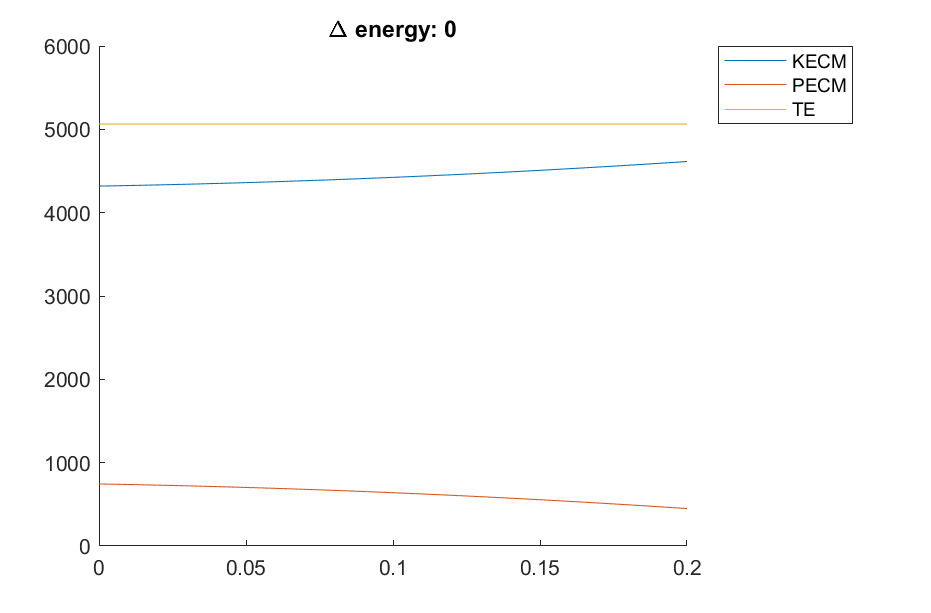
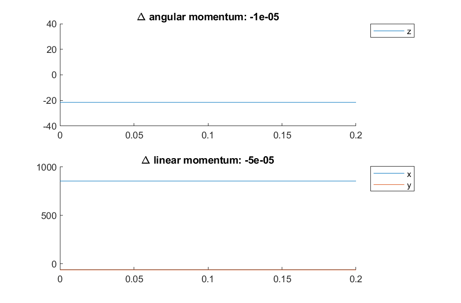

# Energy and momentum conservation

Tests to determine if the equations of model for the model are valid and that energy and momenta are conserved in appropiate situations.

## Energy

By setting torque generator activations, specified mass and angle functions and spring damping parameters set to zero, no energy is gained or lost from the model.

## Momentum

With spring forces and gravity set to zero, no external forces or torques are acting on the system so both linear and angular momentum should be conserved.

