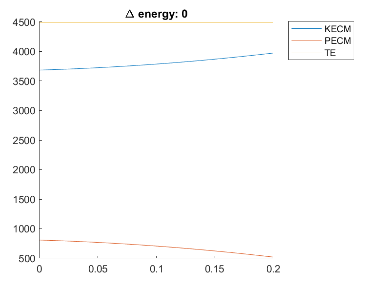
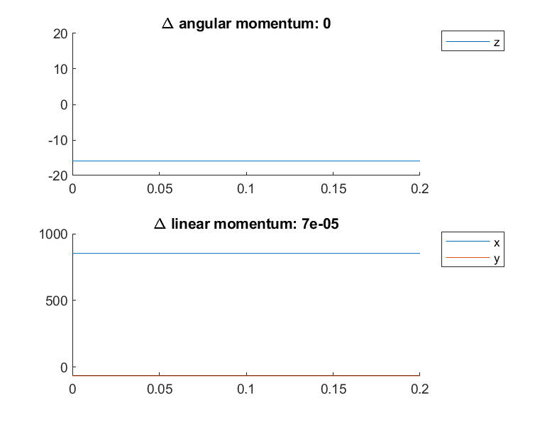

# Energy and momentum conservation

When torque generator activations, mass functions set to zero and spring damping set to zero, no energy is gained or lost.

When spring stiffnesses set to zero, there are no external forces or torques applied to the model, so linear and angular momentum are constant.

## Conserves energy:

## Conserves angular and linear momentum:

